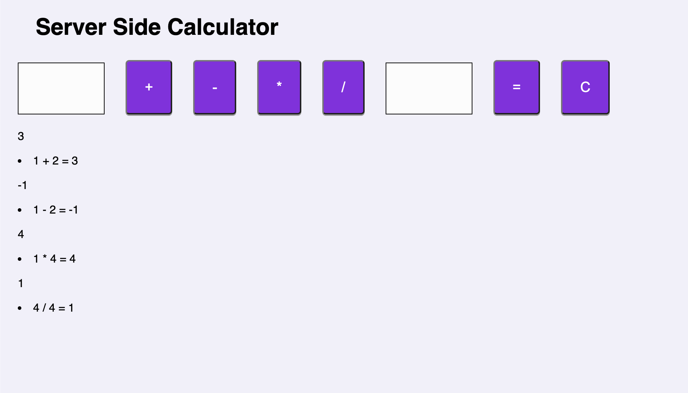

# Jquery Server Calculator

## Description
Created a user interface where the user can input two values (2 input elements) and the select type of mathematical operation. The mathematical result can be calculated and displayed. 

Built out the server-side logic to compute the numbers. The server can handle Addition, Subtraction, Multiplication, and Division. 

Kept a historical record of all math operations and solutions on the server. Display a list of all previous calculations on the page. Update the list when a new calculation is made.

## Installation
1. Simply download or clone this repository
2. Open up your editor of choice and make sure that Node.js is installed 
<<<<<<< HEAD
3. Run 'npm install -g npm' 
=======
3. Run 'npm install -g npm'
>>>>>>> 0add9ddd1667128c156e2e82043ec97043876239
3. Run 'npm start' in you terminal 
4. Open 'http://localhost:5000/' in browser

## Screen Shot

### Prerequisites
<<<<<<< HEAD
- Browser and editor of choice 
=======
- Editor and browser of choice
>>>>>>> 0add9ddd1667128c156e2e82043ec97043876239
- [Node.js](https://nodejs.org/en/)

## Usage
1. User can enter two values 
2. Select type of mathematical operation (addition, subtraction, multiplication, and division).
3. The mathematical result can be calculated when the user click '=' button. The result will be displayed on the screen. 
4. The history of calculation will be recorded on the screen after the '=' button is clicked. 
5. User will also be able to clear history by clicking 'C' button. 

## Built With
<<<<<<< HEAD
HTML, JAVASCRIPT, JQUERY, NODE,CSS
=======
HTML, JAVASCRIPT, JQUERY, NODE, CSS
>>>>>>> 0add9ddd1667128c156e2e82043ec97043876239

## Acknowledgement
Thanks to [Prime Digital Academy](www.primeacademy.io) who equipped and helped me to make this application a reality. 

## Support
If you have suggestions or issues, please email me at [nguy2884@umn.edu]